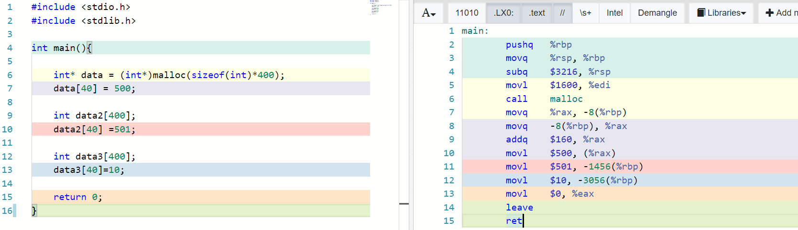

# x86-64 Assembly 

> "Nearing Machine Code Representation"

## Introduction/Motivation

Not so long ago (in a galaxy not so far away), programmers wrote most of their code in assembly. While programmers today primarily use higher level languages (Python, C, etc), it is not uncommon to debug the assembly of your code. These higher level languages afterall typically translate down to an assemble or assembly-like language. 

If you are interested in cybersecurity and reverse engineering, folks more frequently write and analyze assembly code. For high performance applications like [games](https://www.gamasutra.com/view/news/169946/CC_low_level_curriculum_Looking_at_optimized_assembly.php), programmers may write very optimized code using assembly to get things *just* right. If you are working in hardware or an embededd device, you might also do some assembly programming, as other languages environments are too bulky to support on a small device. Even web developers are using something called 'webassembly'. Hmm, the list is getting long here--I think the point is that learning assembly has quite some relevance! Let's dig in and get some practice.

In today's lab you are going to get some practice looking at assembly.

# Part 0 - Godbolt

I **strongly** recommend using the godbolt tool (https://godbolt.org/) to write and experiment with your C programs for this exercise.  The color mappings will help you see what is going on with the generated assembly. You **should** try using both godbolt and your compiler to generate assembly.

Here is an example of the Godbolt tool (and also shows part 4 of this lab)

# Part 1- Compiler Generated Assembly

Let us get some experience reading assembly code generated by the compiler (or godbolt)! It is actually kind of fun, you may learn some new instructions, and at the very least gain some intuition for what code the compiler is generating.

## Compiler generated assembly 1 - Swap

- Write a C program that swaps two integers(in the main body of code).
  - Save, Compile, and Run the program to verify it works.
- Output the assembly from that program (Save it as swap_int.s).
  - Use: `gcc -O0 -fno-builtin swap_int.c -S -o swap_int.s`
- Now modify your program to swap two long's.
  - Save, Compile, and Run the program to verify it works.
- Output the assembly from that program (Save it as swap_long.s).
  - Use: `gcc -O0 -fno-builtin swap_long.c -S -o swap_long.s`
- Compare each of the two assembly files using diff. See what changed.
- diff syntax
  - Use: `diff -y swap_int.s swap_long.s`
  
### Response/Observations

*Add your observations/response if anything changed here*
1. The first line is changed, since we are generating assemblies from different .c files;
2. "movl" for swap_int.c has been changed to "movq", which means we are moving 8-byte(quad word) instead of 4-byte(long word) once a time. This is because C int is a Double word with Assemly-code suffix l of size 4, while C long is a Quad word with Assembly-code suffix of q of size 8.  At the same time, the offset values have been doubled.

==================================================================================
## Compiler generated assembly 2 - Functions

- Write a C program that swaps two integers in a **function** (You may use today's slide as a reference)
  - Save, Compile, and Run the program to verify it works.
- Output the assembly from that program (Save it as swap.s).
  - Use: `gcc -O0 -fno-builtin  swap.c -S -o swap.s`
- Do the instructions use memory/registers in a different way?
Yes.
### Response/Observations

*Add your observations/response about registers here*
The Assembly changed a lot.
1. At the begining, we have an extra chunk of assembly codes, which I infer is the assembly codes for the function definition.
2. When carrying out the real manipulation, a.k.a., call the swap function and pass in the arguments, the assembly codes looks much similar with those of swap_int.s, which means they work in similar workflow, however, they differ in detail:
   a. The first few lines are pretty much the same (I think the codes are doing the initialization), except that the function version has a few extra lines at top.  I googled and guess these lines are related with the swap function.
       movq %fs:40, %rax     // get the function?
       movq %rax, -8(%rbp)  // place on stack
       xorl %eax, %eax     // clear it
     The following lines are just doing the initialization and call print function to print the initial values out, and both two versions act in the same way.
   b. After that, the swap_int.s directly does the swapping, while swap.s calls the swap function.  While calling the function, swap.s uses movq instead of movl, which I think is because it is passing in addresses of the integers instead of integer.  Within the function, the actual swapping operations of the swap.s and swap_int.s are same.
3. After swapping and print out the result, the swap.s does some closing work, and I infer it is related to clear the function on stack.

================================================================================
## Compiler generated assembly 3 - Static Array
- Write a C program called array.c that has an array of 400 integers in the function of main.
  - Initialize some of the values to something (do not use a loop) (e.g. myArray[0]=72; myArray[70]=56; etc)
  	- Note that it is helpful to use 'weird' numbers so you can see where they jump out.
  - Save, Compile, and Run the program to verify it works.
- Output the assembly from that program (Save it as array.s).
  - Use: `gcc -O0 -fno-builtin -mno-red-zone array.c -S -o array.s`
- How much are the offsets from the address?
4 offset for each element.
### Response/Observations

*Write how much are the offsets from the address if any here*
For each element in the array, the offset is 4.
-1616, -1612, -1608......., -20.

=================================================================================
## Compiler generated assembly 4 - Dynamic Array 

- Write a C program called array2.c that has an array of 400 integers in the function of main that is dynamically allocated.
  - Initialize some of the values to something (do not use a loop) (e.g. myArray[66]=712; myArray[70]=536; etc)
  - Save, Compile, and Run the program to verify it works.
- Output the assembly from that program (Save it as array2.s).
  - Use: `gcc -O0 -fno-builtin  array2.c -S -o array2.s`
- Study the assembly and think about what is different from the static array.

### Response/Observations

*Write here if there is anything different from the static vs dynamic array*
1. Different from the static array, the dynamic array is manipulating in just one particular memmory address for each of the initialization of its elements.  I think this is because the real elements reside in heap, and here the memory address is where the pointer to the array resides.
2. The assembly codes for dynamic array has 4 lines of operation to assign the value and increment the pointer, while the static version directly assign the values.

=======================================================================================
## Compiler generated assembly 5 - Goto
The C programming language has a 'goto' command, search how to use it if you have not previously.

- Write a C program using the goto command and a label.
  - Save, Compile, and Run the program to verify it works.
- Output the assembly from that program (Save it as goto.s).
  - Use: `gcc -O0 -fno-builtin  goto.c -S -o goto.s`
- Observe what kind of jmp statement is inserted.

### Response/Observations

*Write here what kind of jmp statement is inserted*

## Compiler generated assembly 6 - For-loops
- Write a C program using a for-loop that counts to 5.
  - Save, Compile, and Run the program to verify it works.
- Output the assembly from that program (Save it as for.s).
  - Use: `gcc -O0 -fno-builtin  for.c -S -o for.s`
- Observe where the code goes for the condition statement (at the start or at the end?).

### Response/Observations

*Write here a note about where the code goes for the condition statement.*

## Compiler generated assembly 7 - Switch Statements

- Write a C program using a switch statement (Sample here)[https://www.tutorialspoint.com/cprogramming/switch_statement_in_c.htm].
  - Save, Compile, and Run the program to verify it works.
- Output the assembly from that program (Save it as switch.s).
  - Use: `gcc -O0 -fno-builtin switch.c -S -o switch.s`
- See what code a switch statement generates. Is it optimal?

### Response/Observations

*Write here your observations with a switch statement*

## Compiler generated assembly 8 - Add Function

- Write a C program that calls an add function(long add(long a, long b).
  - Save, Compile, and Run the program to verify it works.
- Output the assembly from that program (Save it as add.s).
  - Use: `gcc -O0 -fno-builtin add.c -S -o add.s`
- Observe the outputs
- Observe arguments put into registers
- Observe where 'popq' is called.

### Response/Observations

*Write here where popq is called*

# More resources to help

- Matt Godbolt has written a great tool to help understand assembly generated from the compiler. 
  - https://godbolt.org/
- An assembly cheat sheet from Brown
  - https://cs.brown.edu/courses/cs033/docs/guides/x64_cheatsheet.pdf
- MIT Cheat sheet
  - http://6.035.scripts.mit.edu/sp17/x86-64-architecture-guide.html

# Deliverable

- For part 1, add your .S files that you have generated to this repository.
  - Note this submission will be auto graded for completion (i.e. save the file names as shown).
  - Add your observations in the appropriate response/observations section for each code.

# Going Further

- (Optional) Try the objdump example to read the disassembly from your programs executables. Observe how close the output is to the compiler generated output.
